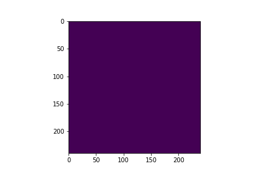

# Brain-Tumor-Segmentation-using-CNN-in-MRI-images.
To develop a Convolutional Neural Network (CNN) segmentation model to diagnose  brain   tumor    using Magnetic Resonance Imaging (MRI) images.   
The project was run on Google Colab that provided a single 12GB NVIDIA Tesla K80 GPU.  
       These are 155 slices per MRI sequence of a particular patient.  

## Dependencies :
 1. Numpy
 2. Matplotlib
 3. Keras
 4. SimpleITK
  
## Dataset :
For downloading the dataset
 1. Go to "https://www.smir.ch/BRATS/Start2015".
 2. Register in there with official E-mail id.
 3. After confirming they will send the logins to your E-mail id.
 4. Login in there and go to "Challenges/BRATS2015".
 5. Then download the training and train dataset. But they won't provide the ground truth for test dataset.
  
## Files Description
In the codes folder following files are there :  
1. utils.py                 : It is the utility script containing the data loading and data augmentation code.
 2. simple_model.py          : It is the utility script containing simple CNN model implemented in the paper.
 3. unet_model.py            : It is the utility script containing the Unet model.
 4. Brain_segmentation.ipynb : It is notebook containing both the models executed 5 and 35 epochs respectively.
 5. Assets 		    : It contains the sample dataset for just one patient and some files linked to notebook
